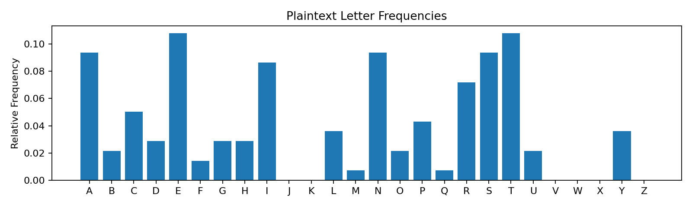
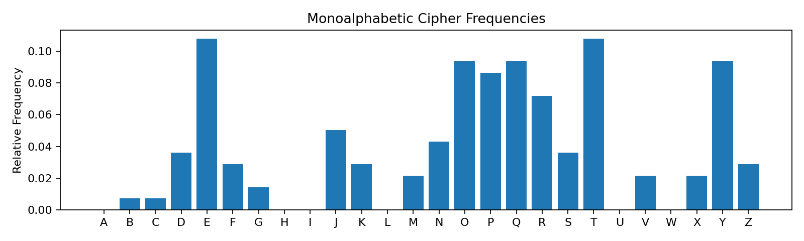
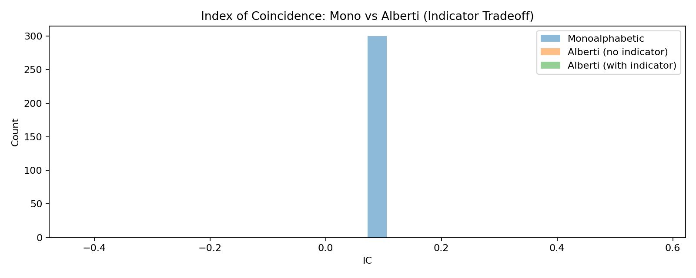
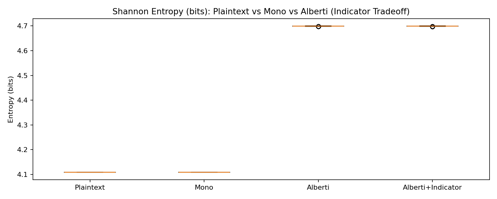

# Leon Battista Alberti (1404–1472)
## The Birth of Polyalphabetic Cryptography

<p align="center">
  
</p>

---

---

## Overview

Leon Battista Alberti is widely regarded as the father of Western polyalphabetic cryptography.

In 1467, his treatise *De Cifris* introduced a revolutionary idea:

> **Change the substitution alphabet during encryption.**

This innovation directly countered statistical frequency analysis methods developed centuries earlier.

This project reconstructs Alberti’s cipher disk in Python and evaluates its statistical impact using:

- Letter frequency analysis  
- Index of Coincidence (IC)  
- Shannon entropy  
- Monte Carlo simulation  

---

## 1. The Problem: Monoalphabetic Substitution

Monoalphabetic substitution preserves plaintext statistics.

Index of Coincidence (IC):

$$IC = \frac{\sum_i n_i(n_i-1)}{N(N-1)}$$

From our corpus:

- **Plaintext IC:** `0.07214620967842336`  
- **Monoalphabetic IC (mean):** `0.07214621`  
- **Std dev (300 trials):** `9.730683e-17`  

Conclusion:

> Monoalphabetic substitution does not alter statistical structure.

### Frequency preservation

  


---

## 2. Alberti’s Breakthrough: Rotating Cipher Disk

Alberti introduced:

- Two concentric disks  
- Rotating inner alphabet  
- Periodic switching of substitution mapping  

This creates a **time-varying cipher**.

---

## 3. Statistical Impact: Index of Coincidence

Monte Carlo results (300 trials):

| Scheme | Mean IC | Std Dev |
|---|---:|---:|
| Monoalphabetic | 0.07214621 | 9.730683e-17 |
| Alberti (no indicator) | 0.038483 | 0.000027 |
| Alberti (with indicator) | 0.038485 | 0.000028 |

### Interpretation

- Mono preserves coincidence probability (and therefore plaintext structure).  
- Alberti collapses IC to ~0.0385.  
- ~0.0385 is the classic “near-random” coincidence baseline for A–Z text.  

### IC distribution



---

## 4. Shannon Entropy Analysis

Measured entropy:

- **Plaintext entropy:** `4.10797505838597` bits  
- **Theoretical max (uniform A–Z):** `4.700439718141093` bits  

Permutation ciphers (monoalphabetic substitution) preserve the underlying symbol distribution, so entropy remains essentially unchanged.

Alberti’s rotating alphabet redistributes frequent plaintext letters across multiple ciphertext symbols, flattening the distribution and pushing entropy upward toward the theoretical maximum.

In information-theoretic terms, the cipher reduces redundancy in the symbol distribution, thereby suppressing the statistical signal exploited by classical frequency-based cryptanalysis. As the ciphertext distribution approaches uniformity, predictability decreases — increasing the difficulty of statistical inference attacks.


---

## 5. Indicator Signaling (Operational Synchronization)

To model historical disk switching, we implemented explicit rotation signaling.

Each rotation emits:

```text
|<shift-letter>
```

Example:

```text
|U  (shift = 20)
|D  (shift = 3)
```

This ensures sender/receiver synchronization.

### Security tradeoff

- The indicator introduces metadata (block boundaries + shift letters).  
- Empirically, the statistical impact is negligible.  

Measured IC difference:

$$\Delta IC \approx 0.000002$$
Operational safety can be added without materially weakening statistical resistance.

---

## 6. Cryptographic Significance

Alberti marks the transition from:

- **Ancient:** fixed substitution  
- **Al-Kindi:** statistical attack via frequency analysis  
- **Alberti:** structural defense via alphabet switching  

Alberti introduced:

- Time-varying encryption  
- Early key scheduling concepts  
- Operational synchronization  
- Entropy-based flattening of distributions  

These ideas are conceptual ancestors of:

- Stream ciphers  
- Session keys  
- Modern symmetric key rotation  

---

## 7. Key Findings

- ✅ Monoalphabetic substitution preserves statistical structure (IC unchanged).  
- ✅ Alberti collapses IC to near-random baseline (~0.0385).  
- ✅ Alberti increases ciphertext entropy toward the uniform maximum.  
- ✅ Indicator signaling does not materially weaken IC/entropy outcomes.  
- ✅ Results validated via Monte Carlo simulation.  

---

## Repository Structure

```text
Leon_Battista_Alberti/
│
├── notebooks/
│   ├── 01_Monoalphabetic_vs_Polyalphabetic.ipynb
│   ├── 02_Index_of_Coincidence_Study.ipynb
│   └── 03_Entropy_Comparison.ipynb
│
└── images/
```

---

## Conclusion

Leon Battista Alberti’s cipher disk represents an early, deliberate engineering response to statistical cryptanalysis.

Where frequency analysis exposed vulnerability, Alberti engineered statistical resistance — and this module demonstrates that transformation quantitatively.

---

##  How to Run

### 1. Clone the repository

``` bash
git clone https://github.com/Rob-Gravelle/mathematicians-in-cryptography.git
cd mathematicians-in-cryptography/Leon_Battista_Alberti
```

------------------------------------------------------------------------

### 2. (Optional) Create a virtual environment

``` bash
python -m venv venv
venv\Scripts\activate   # Windows
# source venv/bin/activate  # macOS/Linux
```

Install required dependencies:

``` bash
pip install numpy pandas matplotlib
```

------------------------------------------------------------------------

### 3. Launch Jupyter Notebook

``` bash
jupyter notebook
```

------------------------------------------------------------------------

### 4. Run notebooks in order

``` text
notebooks/
├── 01_Monoalphabetic_vs_Polyalphabetic.ipynb
├── 02_Index_of_Coincidence_Study.ipynb
└── 03_Entropy_Comparison.ipynb
```

Execute each notebook top-to-bottom.

------------------------------------------------------------------------

### 5. Generated Output

Figures and analysis outputs are automatically saved to:

``` text
images/
```

Including:

-   Letter frequency plots\
-   Index of Coincidence histograms\
-   Shannon entropy comparison boxplots

------------------------------------------------------------------------

### Reproducibility Notes

-   Monte Carlo experiments use fixed random seeds where indicated.
-   Results may vary slightly if seeds are modified.
-   All statistical values reported in the README were generated
    directly from the notebooks in this directory.
---

## MIT License

Copyright (c) 2026 Rob Gravelle

Permission is hereby granted, free of charge, to any person obtaining a copy
of this software and associated documentation files (the "Software"), to deal
in the Software without restriction, including without limitation the rights
to use, copy, modify, merge, publish, distribute, sublicense, and/or sell
copies of the Software, and to permit persons to whom the Software is
furnished to do so, subject to the following conditions:

The above copyright notice and this permission notice shall be included in all
copies or substantial portions of the Software.

THE SOFTWARE IS PROVIDED "AS IS", WITHOUT WARRANTY OF ANY KIND, EXPRESS OR
IMPLIED, INCLUDING BUT NOT LIMITED TO THE WARRANTIES OF MERCHANTABILITY,
FITNESS FOR A PARTICULAR PURPOSE AND NONINFRINGEMENT. IN NO EVENT SHALL THE
AUTHORS OR COPYRIGHT HOLDERS BE LIABLE FOR ANY CLAIM, DAMAGES OR OTHER
LIABILITY, WHETHER IN AN ACTION OF CONTRACT, TORT OR OTHERWISE, ARISING FROM,
OUT OF OR IN CONNECTION WITH THE SOFTWARE OR THE USE OR OTHER DEALINGS IN THE

SOFTWARE.


